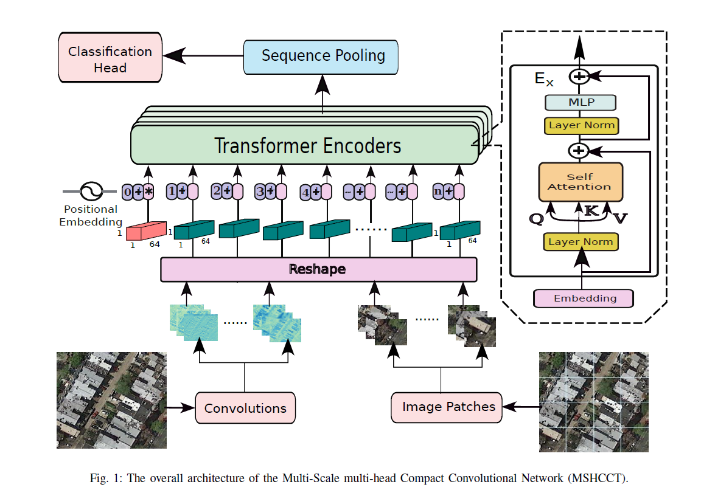
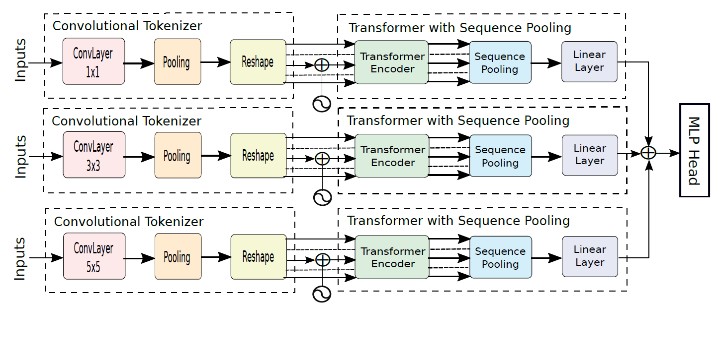

# MSHCCT
MSHCCT: A Multi-Scale Compact Convolutional Network for Aerial Imagery Classification

[Ali Jamali](https://www.researchgate.net/profile/Ali-Jamali), [Swalpa Kumar Roy](https://swalpa.github.io), [Bing Lu](https://www.sfu.ca/people/binglu/about.html), [Leila Hashemi Beni](https://www.ncat.edu/employee-bio.php?directoryID=1901247546), [Nafiseh Kakhani](https://www.researchgate.net/profile/Nafiseh-Kakhani), and [Pedram Ghamisi](https://www.iarai.ac.at/people/pedramghamisi/)

___________

Citation
---------------------

**Please kindly cite the papers if this code is useful and helpful for your research.**

@ARTICLE{10945957,

  author={Jamali, Ali and Roy, Swalpa Kumar and Lu, Bing and Beni, Leila Hashemi and Kakhani, Nafiseh and Chanussot, Jocelyn and Ghamisi, Pedram},
  
  journal={IEEE Geoscience and Remote Sensing Letters}, 
  
  title={MSHCCT: A Multi-Scale Compact Convolutional Network for High Resolution Aerial Scene Classification}, 
  
  year={2025},
  
  volume={},
  
  number={},
  
  pages={1-1},
  
  keywords={Transformers;Computer architecture;Remote sensing;Feature extraction;Computer vision;Computational modeling;Head;Adaptation models;Training;Scene classification;Compact Convolutional Network;attention mechanism;image classification;vision transformers},
  
  doi={10.1109/LGRS.2025.3556373}}

Acknowledgement
---------------------
The CCT is implemented from [Compact-Transformers](https://github.com/SHI-Labs/Compact-Transformers)
